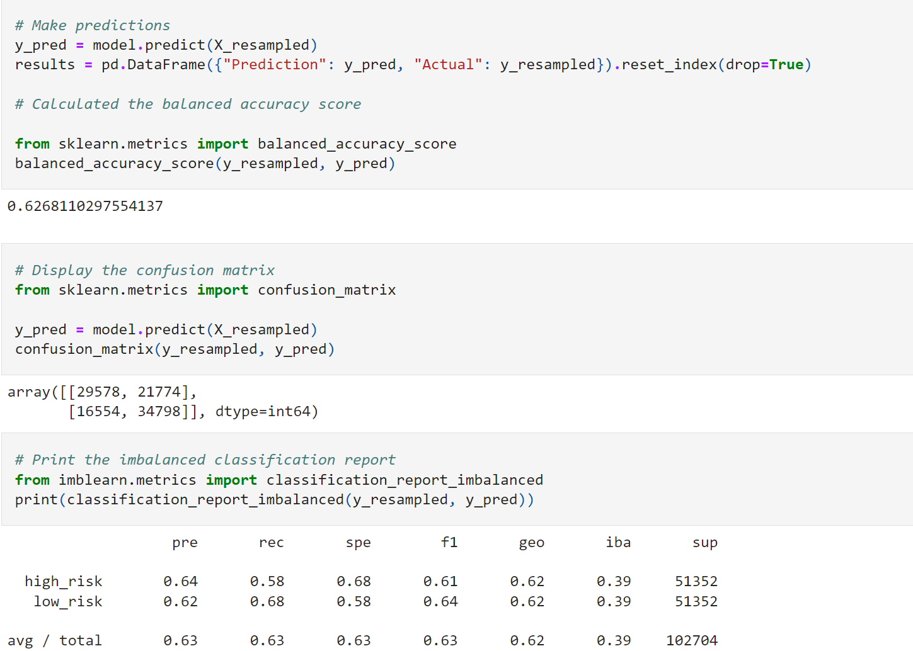
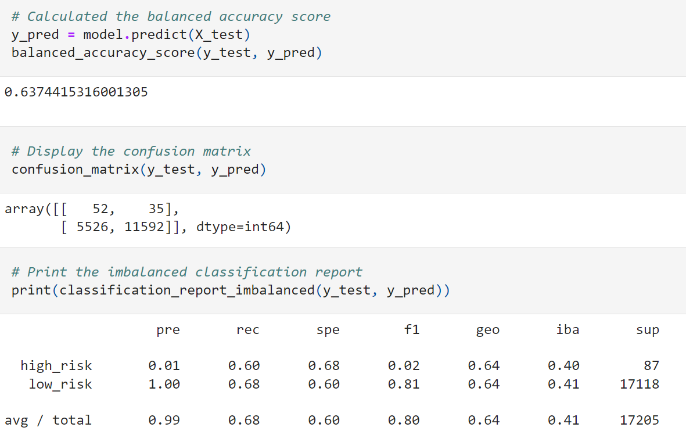
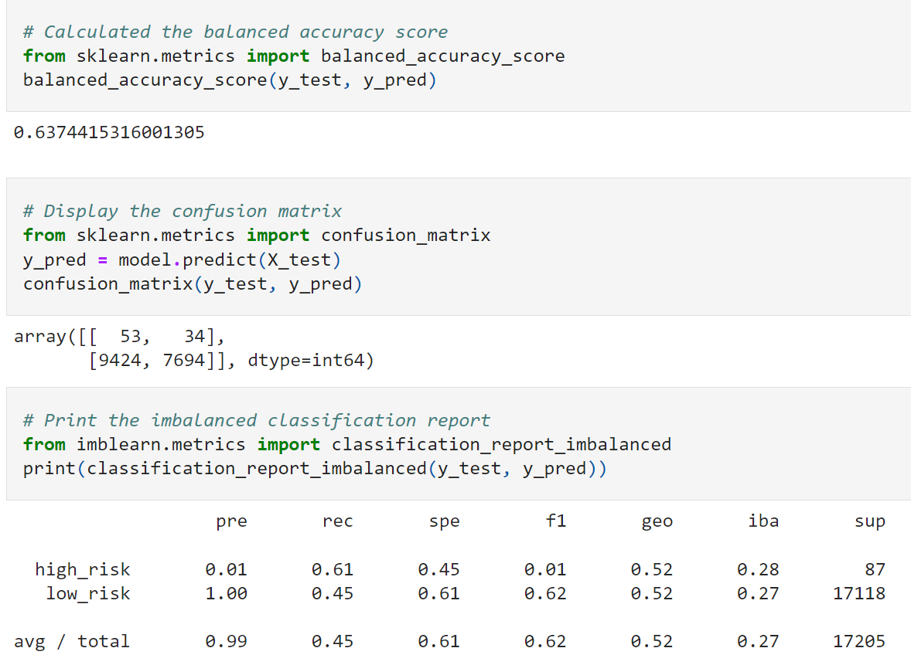
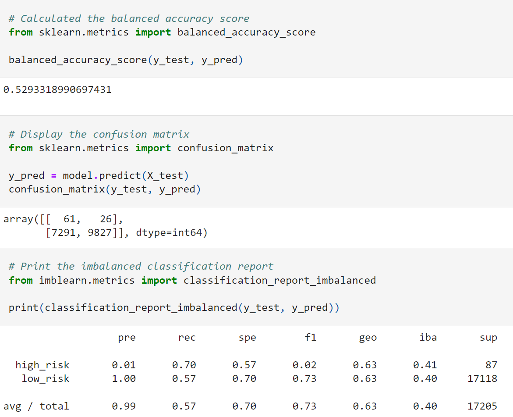
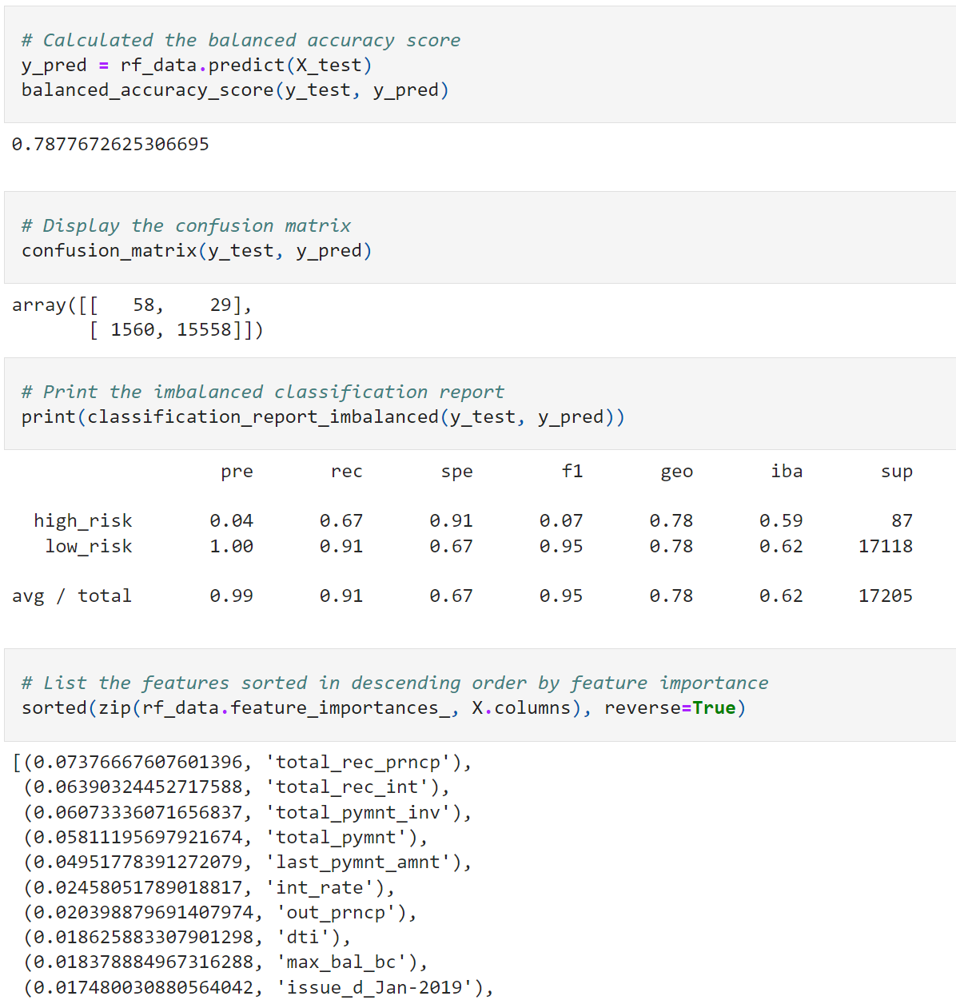
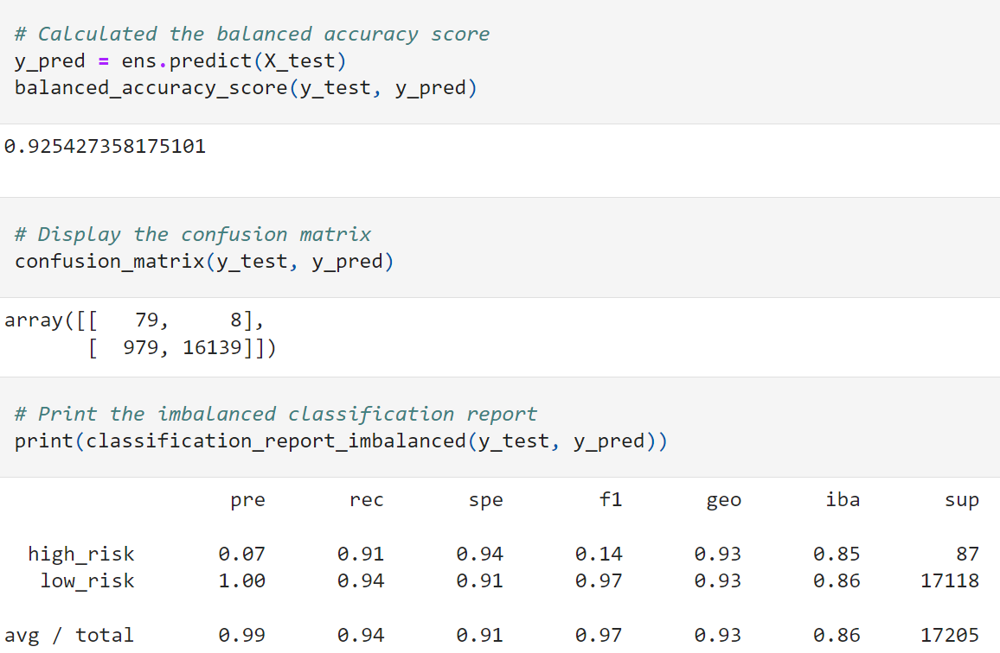

# Machine Learning Driven Credit Risk Analysis

    

## 
Utilizing Machine Learning to analyze and assess Credit Risk

<a href="#goals">Goals</a> &nbsp;&bull;&nbsp;
<a href="#dataset">Dataset</a> &nbsp;&bull;&nbsp;
<a href="#tools-used">Tools Used</a> &nbsp;&bull;&nbsp;
<a href="#results">Results</a> &nbsp;&bull;&nbsp;
<a href="#summary">Summary</a>

# 
Goals

Credit risk is an inherently unbalanced classification problem, as good loans easily outnumber risky loans. Therefore, we'll need to employ different techniques to train and evaluate models with unbalanced classes. We'll use imbalanced-learn and scikit-learn libraries to build and evaluate models using resampling.

 We'll oversample the data using the RandomOverSampler and SMOTE algorithms, and undersample the data using the ClusterCentroids algorithm. Then, use a combinatorial approach of over and undersampling using the SMOTEENN algorithm. Next, we'll compare two new machine learning models that reduce bias, BalancedRandomForestClassifier and EasyEnsembleClassifier, to predict credit risk. The purpose is to evaluate the performance of these models and make a written recommendation on whether they should be used to predict credit risk.

# 
Dataset

Using the credit card credit dataset from LendingClub, a peer-to-peer lending services company, we'll process a CSV to use for training and testing data.

- [Loan Stats Q1 2019:](data/LoanStats_2019Q1.csv) CSV file containing 115,677 rows of borrower data

# 
Tools Used

- **Python:** Programming language used to build app to automate election audit
    - **Imbalanced Learn:** Python library containing tools for dealing with classification with imbalanced classes
    - **Scikit Learn:** Python library with classification, regression and clustering algorithms
    - **Numpy:** Open source Python library used for advanced scientific computing
    - **SciPy:** Open source Python library used for scientific computing and technical computing    

# 
Results

## - Random Oversampler

## - SMOTE Oversampler

## - ClusterCentroids Undersampler

## - SMOTEENN Combination (Over and Under) Sampling

## - Balanced Random Forest Classifier

## - Easy Ensemble Classifier

# 
Summary

After reviewing all of the samples, we recommend the Easy Ensemble Classifier to run the credit risk analysis. The algorithm yielded the highest balanced accuracy at 92%. Given the sensitive nature of assessing risk for lenders, we want the model that yields the most accurate results. 

[Back to top](#machine-learning-driven-credit-risk-analysis)
